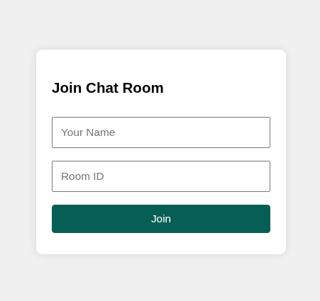
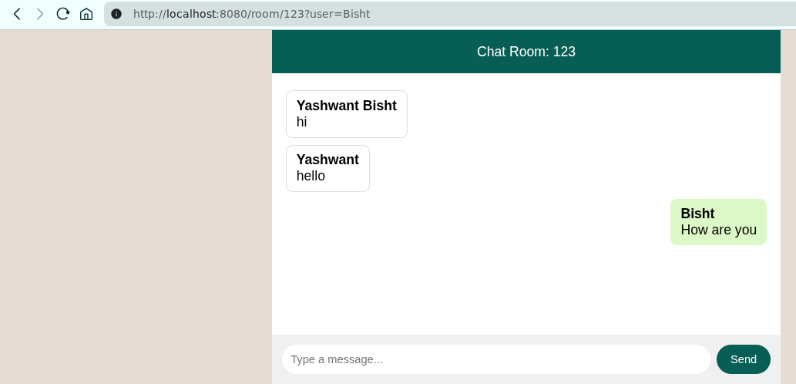
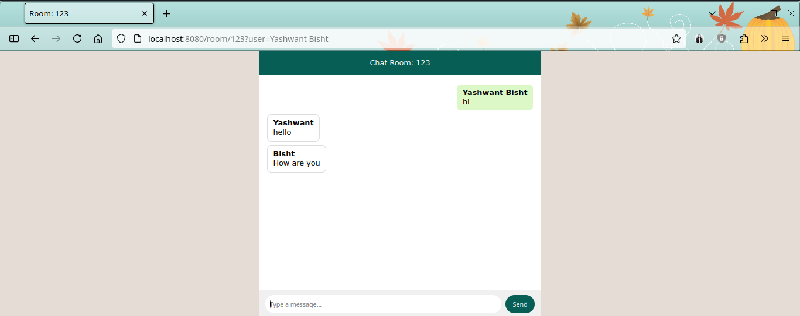

# Realtime-Chat

A lightweight, real-time chat application built with Go, Gin, and Server-Sent Events (SSE). It features a simple join page, persistent usernames via `localStorage`, and a WhatsApp-inspired chat UI.

---

## 🚀 Features

* **Join Page**: Enter your name and room ID to join.
* **Persistent Username**: Your name is saved in browser `localStorage`.
* **Real-Time Updates**: Server-Sent Events (SSE) push new messages automatically.
* **Room-Based Chat**: Multiple rooms identified by room ID.
* **WhatsApp-Style UI**: Modern look with self/other message alignment.

---

## 📁 Project Structure

```text
realtime-chat/
├── go.mod           # Go module definition
├── go.sum           # Dependency checksum file
├── main.go          # Server setup, routes, SSE handler
├── rooms.go         # Room manager, broadcaster logic
├── template.go      # Bundled HTML templates (join_page & chat_room)
├── Makefile         # Dependency and build commands
└── realtime-chat    # Compiled binary (included, can be run directly)
```

---

## 🖼️ Screenshots

| Join Page                                    | Chat Room UI                                 |
| -------------------------------------------- | -------------------------------------------- |
|  |  |  
s
---

## ⚙️ Tech Stack

* **Go**: Core language for backend.
* **Gin**: HTTP router and middleware.
* **github.com/dustin/go-broadcast**: Simple broadcast channel implementation.
* **Server-Sent Events**: Unidirectional server-to-client push updates.
* **HTML/CSS/JavaScript**: Frontend, with jQuery for AJAX and SSE handling.

---

## 🛠️ Prerequisites

* Go (>=1.22) \[only required if you want to rebuild from source]
* Git (for cloning)

---

## 🔧 Installation & Running

### Option A: Use Included Binary

1. **Clone the repository**

   ```bash
   git clone https://github.com/bisht-yashwant/go_simple_chat_app.git
   cd realtime-chat
   ```
2. **Run the pre-built binary**

   ```bash
   ./realtime-chat
   ```

### Option B: Build from Source

1. **Install dependencies & compile**

   ```bash
   make
   ```

   This will download dependencies and build the `realtime-chat` binary.

2. **Run the server**

   ```bash
   ./realtime-chat
   ```

### Access the App

Open your browser and navigate to:

```
http://localhost:8080/
```

---

## 🧠 How It Works

1. **Join Flow**

   * User submits name & room ID at `/` (join page).
   * Server redirects to `/room/:roomid?user=<username>`.
   * Name is saved in `localStorage` for persistence.

2. **Chat Flow**

   * **SSE Stream**: Client opens `EventSource('/stream/:roomid')`.
   * **Listeners**: `roomManager` registers a Go channel per client.
   * **Broadcast**: `roomManager.Submit()` sends messages into a central loop.
   * **SSEEvent**: New messages are pushed via `c.SSEvent("message", msg)`, flushed to all clients.
   * **Client Render**: JS listens for `message` events, formats, and appends messages.

---

## 🔨 Configuration

* **Server Port**: Default is `:8080`. Change in `main.go` ( `router.Run(":8080")` ).
* **Broadcast Buffer**: Default size is `10`. Adjust in `broadcast.NewBroadcaster(10)`.

---

## 🙋‍♂️ Contributing

1. Fork this repo.
2. Create a feature branch.
3. Commit your changes.
4. Push to your branch.
5. Open a Pull Request.

---

## 📄 License

This project is licensed under the MIT License. See [LICENSE](LICENSE) for details.

---

*Built with ❤️ by Yashwant Bisht*
